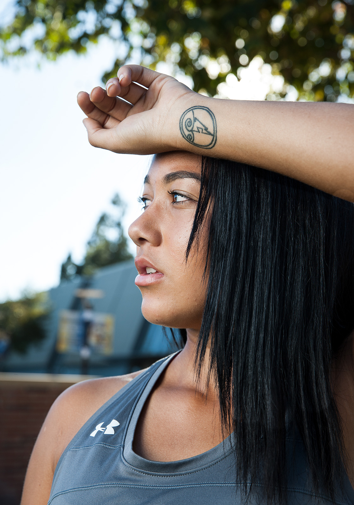
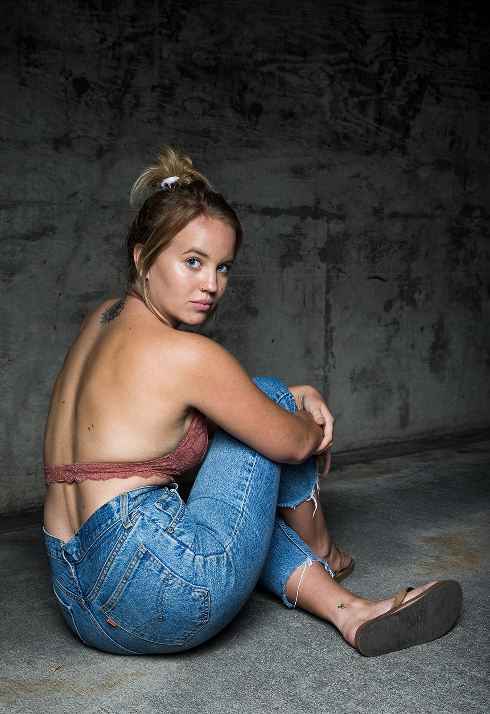
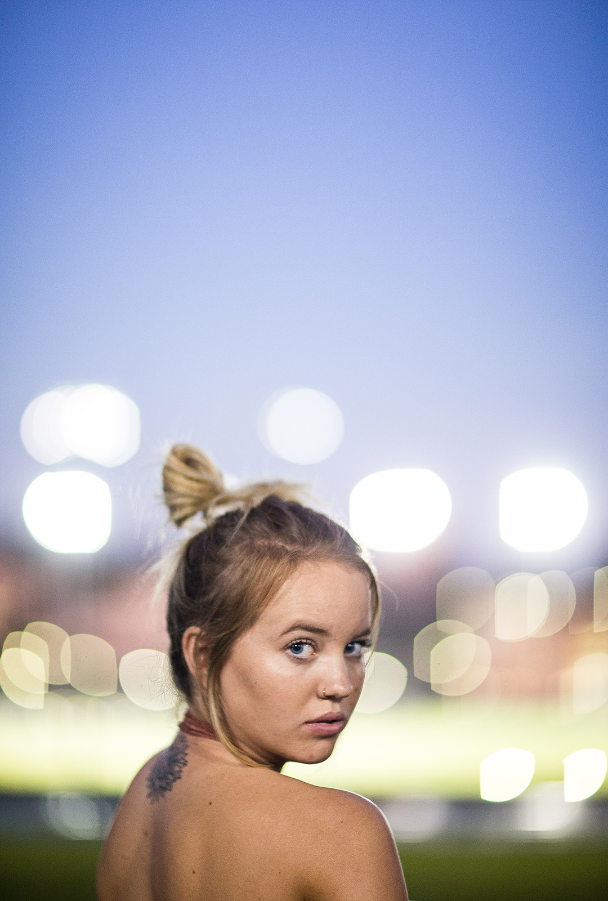

They flash across an arm reaching toward a football at the Rose Bowl, glisten
through the water of Spieker Aquatics Center or glow under the lights of Pauley
Pavilion.

Whether small and understated or bold and prominent, each tattoo comes with a
hidden story.

UCLA football's senior defensive back Jaleel Wadood has Jesus tattooed on his
right arm, while sophomore gymnast Kyla Ross and volunteer assistant gymnastics
coach Jordyn Wieber display Olympic rings on their ribs and wrist, respectively,
to commemorate their trip to the 2012 Summer Olympics.

The tattoos of UCLA’s student-athletes tell stories of friendship, growth and
perseverance that reveal more about each athlete than statistics or
championships ever could.

---

Sitting cross-legged on a sunlit, gray couch, Caroline Coyle couldn’t stop
rubbing a little black bow tattooed on her ankle.

“People see others with tattoos and there's that negative stereotype about (you)
being ... just stupid,” said Coyle, a former coxswain for UCLA women's rowing.
“You find out tattoos usually have meaning for people.”

Coyle’s little bow and her other tattoo on the nape of her neck, depicting a
sunflower with a bumblebee resting on its petals, tell the story of a friendship
– one that’s now eternally memorialized on her body.

Touching the bow on her foot, which she spontaneously got together with her
childhood friend Breanna White, soothed her as she thought back to one of their
adventures.

CC, as Coyle's friends call her, had hoped to surprise White, who had been
dealing with depression, by visiting her at Chapman University in January. But
after driving more than 48 miles south of Westwood, she found out her best
friend’s depression had worsened.

After grappling with homesickness and the unfamiliarity of a college campus,
White had secretly decided to leave Chapman, where she was studying film, to
return home to Sacramento.

Maybe it was the sugar from the two-dozen chocolate-sprinkle Krispy Kreme donuts
they had just scarfed down. Or perhaps it was the need, in one of the hardest
weeks of White’s life, to remember something happier and commemorate their
friendship.

Either way, the two friends found themselves strolling down a cobblestone path
toward a tattoo parlor on a winter afternoon in Old Towne Orange.

They knew exactly what they wanted to get – a bow tie and a tuxedo tie,
respectively – as references to Cher Lloyd’s song "Oath."

“Our favorite lyric is, ‘You are my tuxedo and I'm your bow tie,’” Coyle said.
“So we really were like, ‘Let's do it.’”

Coyle’s fingers slowed down on the bow as she began talking about the sunflower
on her neck. She didn’t get that one with White, although it was inspired by
Manchester Orchestra’s “After the Scripture,” another song they frequently
listened to together.

Coyle got the tattoo in White’s honor, a month after her best friend took her
own life.

“This (bow) I got with her,” Coyle said. “But (the sunflower), I felt that I
should get for her.”

It took Coyle longer to express her thoughts while she reflected on the six
months between getting her tattoos.

The sorrow that overtook her that May evening when she answered a phone call
from a mutual friend left her on the floor of her patio in tears.

The drives in White’s Lexus down darkened Sacramento roads, while White helped
Coyle through her own battles – a struggle with bulimia nervosa as she tried to
maintain the weight required to be a coxswain. Their trip to take photos at what
they thought would be a sunflower field outside of Davis, where they instead
found a barren valley with a lone sunflower in the middle. The memories all
seemed blurry and unclear.

She felt frustrated for not remembering more about her time with White and
guilty for not doing more in the days leading up to her death.

“I still feel guilty a lot of time, because I'm living my life and she's not,”
Coyle said. “Every day, you come to a new understanding of what life without her
is like and what it really means.”

The void is there for Coyle, as well as for White’s other friends who still use
a “Team Bree” group text to keep in touch. But they’ve found meaning in working
to raise suicide awareness, sharing White’s story with groups at their colleges
and high schools, participating in walks and volunteer events and wearing
buttons and ribbons in her honor – anything they can do to prevent another group
of friends from experiencing the same loss.

The sunflower tattoo is just one of the ways Coyle keeps White close to her.

“It's like having her in higher memory as a single object on my body,” Coyle
said. “It’s a part of me that I want to show it like it is – something so
special to me.”

But the activism, tattoos and even the songs are still harsh and painful
reminders to Coyle of the person missing from her life.

“After the Scripture,” with its piercing melancholy tune, gets her through the
sleepless nights during which she thinks about the dances she and White created
together, the theater where they performed and the talks they had on those
nights long ago, driving through the roads of their hometown.

“But I still haven't been able to listen to ‘Oath,’” Coyle admitted. “Just
because it's such a positive song, and I don't quite have a grasp on those
feelings.”

---

Kaiya McCullough spent her life in transition.

Monday through Friday, her afternoons were spent with her mother in Orange
County, where she was an All-American and 2016 Orange County Female Athlete of
the Year at El Toro High School.

Saturdays and Sundays were dedicated to spending time with her father, who had
relocated to San Diego, or hitting the road with the San Diego Surf club soccer
team or the U.S. U-18 Women's National Team.

Curled up on the bus or in the car on the trips between her parents' houses,
McCullough would draw on herself to pass the time – intricate shapes on her arm
or flowers on the top of her thigh. But each night, the ink would wash away.

She decided she wanted something that wouldn’t disappear so easily.

“I wanted something permanent in my ever-changing life,” McCullough said. “Going
from house to house, when I was old enough, it was just I (wanted) something
permanent, and it's going to be with me, and it's never going to change.”

So into a tattoo parlor she went, with her friend by her side. For her first
tattoo, she settled on a medallion on her wrist – one with a cloud and lightning
bolt inspired by the Disney movie “Hercules.”

McCullough, a defender on the women’s soccer team, paused while trying to
describe why she finally decided to get a tattoo.

Her father, legendary UCLA football safety Abdul McCullough, always told her
growing up that her body was “a temple” she shouldn’t mark, and if she did, he
joked he would disown her.

But it’s because of him that she got that medallion tattoo.

Growing up, McCullough admired her father, similar to how Hercules revered his
father, Zeus. And father and daughter connected through their mutual love for
all things Disney.

In an interview with the Los Angeles Times in the 1990s, her father even listed
proximity to Disneyland as a reason he committed to play for the Bruins. His
daughter followed suit two decades later.

McCullough went to the amusement park 33 times in her junior year of high school
alone, and still relishes opportunities to sneak away from a hectic college
schedule to spend a few hours of reprieve in Adventureland.

But to her, Disney was more than movies or an amusement park where she ate
pickles and demanded souvenirs, leading her parents to jokingly christen her
“Princess Kaiya.”

Disneyland was one of the few things she and her father could bond over,
especially after Kaiya McCullough's mother, former UCLA gymnast Amy Thorne, and
her father divorced.

The magic was there for the pair, whether it was spinning in a colorful teacup
with the Mad Hatter or making their way through the Temple of the Forbidden Eye
with Indiana Jones – their favorite ride.

While waiting in line for rides, Abdul McCullough created elaborate stories to
entertain Kaiya McCullough and her cousin.

He pretended to step gingerly on the cinder blocks in the darkened caves of the
Indiana Jones line, cautioning the two young girls not to step on the symbols on
the floor or risk inadvertently setting off booby traps that would crush them
all.

“To this day I still haven’t stepped on one,” McCullough said.

And she has replicated that magic with her UCLA women’s soccer family. After
taking Australian native Teagan Micah to Disneyland for the first time, the
goalkeeper is just as enamored with the amusement park.

McCullough's tattoo serves as a reminder of happy memories at Disneyland and
motivation as she walks, trains and competes on the same campus her parents did.

“I look at it ... (as) my connection to my dad and how he motivates me,”
McCullough said. “It's facing toward me, which is atypical for arm tattoos,
because it's something I can look at and reminds me I can be strong, I can go
the distance. It’s my mantra.”

Her dad’s messages help, too.

Each morning, McCullough reads the motivational quotes her dad texts, tweets or
sends her way to start the day.

Her favorite isn’t a Walt Disney quote.

It’s her dad’s own message – a simple "good luck" encouraging her to conquer the
day.

---

Nicolas Saveljic strolled into the J.D. Morgan Athletic Center, fresh out of
class on a Wednesday afternoon.

He extended his long arms and shook my hand, ready for one of his first
interviews as a member of the UCLA men’s water polo team.

On either side of him sat the team’s assistant coach, Ryder Roberts, and the
team’s sports information director, both ready to help him through his meeting
with me, if needed.

The Montenegro native, who has played for his country’s national team since
2014, didn’t need much help. He was prepared to answer any question – perhaps
one on experiences traveling to European or world championships, or on how he
had become one of the key freshmen for a UCLA team looking to win its third
national championship in four years.

I instead launched into questions about his tattoos, initially confusing the
6-foot-7 attacker, and it showed in his first replies.

Curt one-word answers, sometimes two or three if I was lucky, were all that came
my way.

“Why did you get those tattoos?”

“I liked it.”

“Why is there a snake on your finger?”

“It’s private.”

I’d be lying if I said I didn’t panic at the thought of writing a story with
only those quotes to draw from.

But when he began talking about one of his most prominent tattoos, the word
“Familia” in bold cursive letters on his right bicep, that panic subsided.

Saveljic is close with his sister, Silvana. They share the same tattoo artist,
and her name stretches across his right collarbone underneath red roses, the
only splash of color on his black-and-white sleeve.

But the tatttoo commemorating the bond he shares with his mother is even more
striking.

On his right bicep, Saveljic has an image of a roaring tiger, with his mother’s
face just underneath the feline’s razor-sharp teeth to represent how ferocious
and tough Dijana Saveljic really is.

Talking about their mother-son relationship, which only strengthened after his
parents’ divorce and his sister’s decision to live with their father in France
to finish high school, was effortless for the freshman.

He started with the snake tattoo, one that the mother and son share. It wraps
around his little finger and around his mother’s calf – although she is,
ironically, scared of snakes.

During a birthday party for baby Nicolas Saveljic, someone hid a skull covered
in snakes under Dijana Saveljic’s couch. It’s a story Saveljic is familiar with,
but one he and the other people in the room didn’t quite understand.

“There was a lot of things about that and about her and her enemies,” Nicolas
Saveljic said. “Twenty years ago, it was weird.”

Saveljic got the tattoo to match his mother’s without knowing the story, but for
him it still holds the same meaning of warding off enemies, even if they can’t
be seen.

His mother was diagnosed with breast cancer five years ago when he was just 13
years old, and Nicholas Saveljic, already juggling schoolwork and water polo
training with the club and national teams, didn’t hesitate to become the support
system she needed as she began chemotherapy.

Pick up groceries: check. Run errands: check. Finish homework: check. Go to
water polo practice: check.

“When (I realized I) can lose everything – and my mom is my everything –
everything changed,” Saveljic said. “I had to care about her. We were in this
together.”

Appropriately, one of his first tattoos he got at age 15 reads “per aspera ad
astra.” It’s Latin for “through hardships to the stars.” The cursive words are
framed by an antique arch on his forearm with staircases that lead the words up
to a star – a reminder for the teen to follow through on his dreams of becoming
a professional water polo player.

His perseverance paid off three years later, together with his mother
successfully beating cancer.

Eighteen-year-old Saveljic was presented with two options after what he deemed a
subpar water polo season.

He could stay in Montenegro, where water polo ran year-round and a balance
between schoolwork and athletics was nearly impossible. Or, he could do as his
father suggested and go to the U.S., where he would have time for both academics
and water polo.

A few weeks later, he stepped off the plane in a new country for the first time
as a late recruit for the UCLA team, but one who has settled in nonetheless.

The Bruins have notched wins against California and USC so far this season. But
the goal isn’t to beat those top teams once or twice. It’s to beat them all and
stand alone at the end of the season as national champions.

Even if they come up short, Nicolas Saveljic’s “I have nothing to prove” tattoo,
emblazoned across the armor of Perseus as the Greek hero slays Medusa, serves as
a reminder to the student-athlete that he has nothing to prove to anyone but
himself.

If UCLA does claim the national championship, there’s space on his left arm for
more art to commemorate that milestone. But championship or not, there’s one
thing he won’t ever tattoo onto his arm - coach Adam Wright’s face.

“If I did that then, I’d have to chop my arm off,” Nicolas Saveljic joked as the
other people in the room laughed with him.

In all seriousness, he doesn’t regret anything – his journey that led to UCLA,
his decision to leave Montenegro or his tattoos.

“I’d do it all again,” Nicolas Saveljic said with a nod and a departing
handshake. “Everything the same.”
